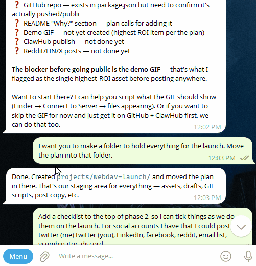

# OpenClaw WebDAV Plugin

Easily collaborate with your agent in their workspace by accessing their files using your laptop or phone from anywhere.

OpenClaw-WebDAV is a zero-dependency WebDAV plugin for OpenClaw that mounts your workspace as a network drive accessible from:

- macOS Finder, Windows Explorer, Linux davfs2
- iOS Files, Android Solid Explorer
- Power tools: Cyberduck, rclone, any WebDAV client

Full RFC 4918 compliance, auth-integrated, rate-limited, traversal-protected.
Makes collaboration possible and pleasant for OpenClaw's deployed in NemoClaw, VPC's, sandboxes, or other isolated deployments.





## Quickstart

1. Run `openclaw plugins install @ragenet/openclaw-webdav` and restart your gateway.
2. Add a network location to your finder/explorer/webdav-client using your tailscale url `https://myclaw.tail123456.ts.net/webdav/` or `\\myclaw.tail123456.ts.net@SSL\webdav\`
3. Login using any username and your token from `openclaw dashboard` as your password


## Features

- Full RFC 4918 WebDAV compliance (DAV level 1 and 2)
- All standard methods: OPTIONS, GET, HEAD, PUT, DELETE, MKCOL, COPY, MOVE, PROPFIND, LOCK, UNLOCK
- **GET / HEAD on directories:** plain-text listing (one name per line; folders end with `/`). Rich browsing remains **PROPFIND** (what real WebDAV clients use).
- Exclusive and shared locking with `If:` header precondition validation
- Read-only mode for safe access
- Upload size limits
- Per-IP rate limiting with sliding window
- Path traversal protection with WARN logging
- Zero external runtime dependencies (standard Node.js only)

## Requirements

- Node.js ≥ 22 (an openclaw prereq)
- OpenClaw (any recent version)
- `pnpm` (for development)
- tailscale, or other https transport for your claw

## Installation


### From the openclaw CLI

```bash
openclaw plugins install @ragenet/openclaw-webdav
```

### From clawhub.ai

```bash
# In OpenClaw settings → Plugins → Browse Community Plugins
# Search for "WebDAV" and click Install
```

### From npm

```bash
pnpm add @ragenet/openclaw-webdav
# or: npm install @ragenet/openclaw-webdav
```

Then register the plugin in OpenClaw (path or package name per your OpenClaw version’s plugin docs).

### Manual Installation

```bash
git clone https://github.com/RageDotNet/openclaw-webdav
cd openclaw-webdav
pnpm install
pnpm run build
```

Then add the plugin path to your OpenClaw configuration.

## Configuration

Configure the plugin in OpenClaw settings → Plugins → WebDAV → Settings:

| Option | Type | Default | Description |
|--------|------|---------|-------------|
| `rootPath` | string | workspace dir | Root directory exposed via WebDAV |
| `readOnly` | boolean | `false` | Block all write operations (405) |
| `maxUploadSizeMb` | number | `100` | Maximum upload size in MB |
| `rateLimitPerIp.enabled` | boolean | `true` | Enable per-IP rate limiting |
| `rateLimitPerIp.max` | number | `100` | Max requests per window |
| `rateLimitPerIp.windowSeconds` | number | `10` | Rate limit window in seconds |
| `logging` | boolean | `false` | Log one `info` line per request (`METHOD` + path). Or set `DEBUG_WEBDAV=1` on the gateway; either enables the same logging |

### Example Configuration

Configuration lives under `plugins.entries.openclaw-webdav.config`

```json
{
  "rootPath": "/home/user/workspace",
  "readOnly": false,
  "maxUploadSizeMb": 500,
  "rateLimitPerIp": {
    "enabled": true,
    "max": 200,
    "windowSeconds": 10
  },
  "logging": false
}
```

## Client Setup Guides

The WebDAV server is available at:
```
http://localhost:18789/webdav/
```

Replace `localhost:18789` with your OpenClaw host and port.

---

### macOS Finder

1. Open Finder
2. Go → Connect to Server (⌘K)
3. Enter your endpoint like this `https://myclaw.tail123456.ts.net/webdav/`
4. Click Connect
5. Enter your OpenClaw credentials when prompted

**Tip**: Add to Favorites for quick access. Finder will appear as a network drive in the sidebar.

**Known quirks**:
- Finder creates `.DS_Store` files; these are stored in your workspace
- PROPPATCH for metadata returns 405 (harmless warning)

---

### Windows Explorer (Map Network Drive)

1. Open File Explorer
2. Right-click "This PC" → Add a network location
4. Enter your endpoint in this format: `\\myclaw.tail123456.ts.net@SSL\webdav\`
5. Check "Connect using different credentials"
6. Enter any username, and your openclaw token as a password
7. Click Finish

**Alternative**: Use the Run dialog (Win+R):
```
\\myclaw.tail123456.ts.net@SSL\webdav\
```

**Known quirks**:
- Windows Explorer requires LOCK/UNLOCK for write operations (fully supported)
- PROPPATCH for Win32 attributes returns 405 (harmless, basic CRUD still works)
- If connection fails, try `\\myclaw.tail123456.ts.net@SSL\webdav` (without trailing slash)

---

### Linux — davfs2

Install davfs2:
```bash
sudo apt install davfs2  # Debian/Ubuntu
sudo dnf install davfs2  # Fedora/RHEL
```

Mount the WebDAV drive:
```bash
sudo mount -t davfs https://myclaw.tail123456.ts.net/webdav/ /mnt/webdav
```

For persistent mounting, add to `/etc/fstab`:
```
https://myclaw.tail123456.ts.net/webdav/ /mnt/webdav davfs user,noauto 0 0
```

Store credentials in `/etc/davfs2/secrets`:
```
https://myclaw.tail123456.ts.net/webdav/ username password
```

**Known quirks**:
- davfs2 caches files locally; changes may not be visible immediately
- Use `umount /mnt/webdav && mount /mnt/webdav` to force refresh
- Increase `cache_size` in `/etc/davfs2/davfs2.conf` for large workspaces

---

### Cyberduck

1. Open Cyberduck
2. Click "Open Connection"
3. Select "WebDAV (HTTP)" from the dropdown
4. Server: `localhost`, Port: `18789`, Path: `/webdav/`
5. Enter your OpenClaw credentials
6. Click Connect

**Tip**: Save as a bookmark for quick reconnection.

---

### rclone

Configure rclone:
```bash
rclone config
# Choose "New remote" → name it "openclaw"
# Type: WebDAV
# URL: http://localhost:18789/webdav/
# Vendor: Other
# Username: your-openclaw-username
# Password: your-openclaw-password
```

Use rclone:
```bash
# List files
rclone ls openclaw:

# Sync local directory to OpenClaw
rclone sync /local/dir openclaw:remote/dir

# Mount as filesystem
rclone mount openclaw: /mnt/openclaw
```

---

### iOS — Files App

1. Open the Files app
2. Tap "..." → Connect to Server
3. Enter: `https://myclaw.tail123456.ts.net/webdav/`
4. Enter credentials
5. Tap Connect

**Note**: iOS requires the server to be reachable over the network (not just localhost).
Use your machine's local IP address or hostname.

---

### Android — Solid Explorer

1. Open Solid Explorer
2. Tap "+" → New Connection → WebDAV
3. Host: `your-openclaw-host`, Port: `18789`
4. Path: `/webdav/`
5. Protocol: HTTP
6. Enter credentials
7. Tap Connect

---

## Security

### Authentication

The WebDAV route uses OpenClaw **`plugin`** HTTP admission (no gateway-layer Bearer check). The
plugin then requires the **same secret the gateway uses for token or password auth**:

- **HTTP Basic:** use **any username** (it is ignored). Set the **password** to your **gateway
  token** (token mode) or **gateway password** (password mode).
- **Bearer:** `Authorization: Bearer <same secret>` still works (e.g. `curl`).

Credential resolution follows OpenClaw’s `resolveGatewayAuth` when the `openclaw` package is
available at runtime; otherwise plain `gateway.auth` strings plus
`OPENCLAW_GATEWAY_TOKEN` / `OPENCLAW_GATEWAY_PASSWORD` are used.

If the gateway is **`auth.mode: none`**, WebDAV does not require a password (only use on trusted
networks). **`trusted-proxy`** mode has no shared secret for WebDAV; the plugin returns **503**
until you use token/password mode or env-based credentials.

**Examples**

```bash
openclaw config get gateway.auth.token

# Basic (password = gateway token; username ignored)
curl -sS -u "any:YOUR_GATEWAY_TOKEN" http://127.0.0.1:28765/webdav/ -X OPTIONS -D -

# Bearer (same secret)
curl -sS -H "Authorization: Bearer YOUR_TOKEN" http://127.0.0.1:28765/webdav/ -X OPTIONS -D -
```

**Finder / Cyberduck / davfs2:** connect with **any username** and the **gateway token (or
password) as the password**.

Startup logs use the **`[plugins]`** subsystem (e.g. `[plugins] [webdav] starting …`) in the same
terminal as `gateway:watch` / `openclaw gateway`.

### Path Scoping

All file access is restricted to the configured `rootPath` (default: workspace directory).
The plugin rejects:
- Directory traversal (`../`, `%2e%2e%2f`, `%252e%252e%252f`)
- Encoded path separators (`%2F`, `%5C`)
- Null bytes and ASCII control characters
- Windows reserved device names (`CON`, `PRN`, `AUX`, `NUL`, `COM1-9`, `LPT1-9`)

Traversal attempts are logged at WARN level with the source IP.

### Read-Only Mode

Set `readOnly: true` to prevent all write operations. In read-only mode:
- PUT, DELETE, MKCOL, COPY, MOVE, LOCK, UNLOCK, PROPPATCH return 405
- GET, HEAD, OPTIONS, PROPFIND continue to work

### Rate Limiting

The default rate limit is 100 requests per 10 seconds per IP. Bulk operations
(PROPFIND depth:infinity, COPY, MOVE) are exempt from per-request counting.

When the limit is exceeded, the server returns:
```
HTTP/1.1 429 Too Many Requests
Retry-After: 5
```

### Upload Size Limit

The default maximum upload size is 100 MB. Uploads exceeding this return:
```
HTTP/1.1 413 Request Entity Too Large
```

---

## Troubleshooting

### Connection refused

- Verify OpenClaw is running: `curl http://localhost:18789/`
- Check the port (default: 18789)
- Verify the plugin is installed and enabled in OpenClaw settings

### 401 Unauthorized

- Send **Basic** auth (password = gateway token or password) or **Bearer** with the same secret
  (see [Authentication](#authentication)).
- A **401** with a `WWW-Authenticate: Basic` header means the plugin did not accept the credential.
- Confirm the token: `openclaw config get gateway.auth.token` (or env `OPENCLAW_GATEWAY_TOKEN`).

### 403 Forbidden

- The requested path may be outside the configured `rootPath`
- Check the `rootPath` configuration

### 404 Not Found

- The file or directory does not exist
- Verify the path is correct

### 423 Locked

- The resource is locked by another client
- Wait for the lock to expire (default: 1 hour) or unlock it manually

### 429 Too Many Requests

- You've exceeded the rate limit
- Wait for the `Retry-After` seconds before retrying
- Increase `rateLimitPerIp.max` in the plugin configuration

### Windows Explorer: "The folder you entered does not appear to be valid"

- Try using `http://` explicitly in the path
- Ensure the URL ends with `/webdav/` (with trailing slash)
- Check Windows WebClient service is running: `net start webclient`

### macOS Finder: "There was a problem connecting to the server"

- Verify the URL format: `http://localhost:18789/webdav/`
- Check that OpenClaw is running and the plugin is enabled
- Use **Connect As** with **any username** and **password = gateway token** (or test with `curl -u any:TOKEN …`)

### davfs2: Files not updating

- davfs2 caches files locally; use `umount` and remount to refresh
- Increase `cache_size` in `/etc/davfs2/davfs2.conf`

### Request logging

Enable the same per-request **`info`** logs (one line per hit: `METHOD` + URL path) in either way:

1. **Plugin config:** set **`logging`** to **`true`** under your WebDAV plugin entry (e.g. `plugins.entries.openclaw-webdav.config.logging` in OpenClaw config), **or**
2. **Environment:** set **`DEBUG_WEBDAV=1`** on the **gateway** process.

If either is on, the plugin also logs a short **startup** note that request logging is active. Lines go through **`api.logger.info`** (often shown under a **`[plugins]`** prefix, depending on gateway log settings).

The per-request line is emitted **at the start** of handling (before auth is checked), so you still see traffic for failing **401**s—use that to confirm the route is hit, then fix Basic/Bearer credentials if needed.

---

## Development

```bash
# Install dependencies
pnpm install

# Build
pnpm run build

# Run unit tests (no OpenClaw required)
pnpm test

# Run WebDAV conformance tests (requires litmus)
pnpm run test:conformance

# Lint
pnpm run lint

# Format
pnpm run format
```

See [CONTRIBUTING.md](CONTRIBUTING.md) for contribution guidelines.

## Compatibility

See [COMPATIBILITY.md](COMPATIBILITY.md) for detailed client compatibility information
and known limitations.

## License

MIT — see [LICENSE](LICENSE)
